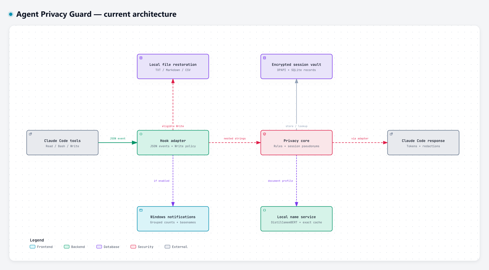

# Architecture and adapter contract

Status: source inspection, native installed-launcher checks and proposed contracts, 2026-10-06. A successful unit test of a hook response is not evidence that an agent accepted that response.

## Current architecture diagram

The [interactive Archify view](ux/privacy-current.html) traces the implementation at `f278402`, with links to the source for each block. It shows the successful tool-result path and its local restoration, vault, name-service and notification branches. The [diagram checks](ux/privacy-current.validation.json) record the source revision and rendering evidence. The proposed enforcement contract remains a separate view below.

## Current flow

1. The installer copies Python source to the user's guard directory and registers command hooks in Claude Code settings.
2. A hook invocation receives a JSON event. The handler records an event and opens a session vault.
3. For a successful tool result, nested **string values** pass through `PrivacyCore.protect`. Non-string values and dictionary keys are left unchanged.
4. The detector combines secret rules, formatted/tabular personal-data rules and a name detector. Document-like reads use the local name process; other outputs use heuristics.
5. Detected spans become tokens. Session mappings are stored through the OS cipher. The adapter emits a replacement tool result.
6. After a successful local Write, the written file can have its personal values restored. The model-facing result remains protected. PreToolUse keeps tokens in arguments and guides token-bearing Edit operations toward the supported Write workflow. CSV export has its own destination policy.
7. Session end deletes that session's vault and triggers stale-vault cleanup. This is deletion, not guaranteed secure erasure of backups or storage media.

The current hook does not first scan every file for personal data before allowing access. It normally acts on the content returned by a tool. It also does not rewrite the final chat response. Automatic restoration happens in local files written through the supported Write workflow.

## Existing modules and interfaces

| Module | Interface / seam | Responsibility and current limitation |
| --- | --- | --- |
| `privacy_guard/core/privacy_core.py` | `PrivacyCore(vault, names).protect(text) / restore(text)` | Span replacement and lookup; no destination policy |
| `privacy_guard/core/detector.py` | `SensitiveDataDetector(names).find(text)` | Ordered findings and overlap priorities; unknown data can be missed |
| `privacy_guard/core/vault.py` | `VaultStore.session(id) / close_session(id)` | Per-session encrypted mappings, transactional bound inserts and legacy file reads |
| `privacy_guard/core/sqlite_records.py` | `batch`, `get`, `put_once` | Opaque encrypted BLOB storage; one connection per operation, immutable inserts |
| `privacy_guard/core/cipher.py` | `Cipher.encrypt/decrypt`; `default_cipher()` | Native OS encryption; only Windows adapter is implemented |
| `privacy_guard/claude_code/hook.py` | `run` / `handle` with injected journal, vaults and names | Event routing and handled-exception responses |
| `privacy_guard/claude_code/protection.py` | `protect_tool_output` | JSON string mapping; local Write restoration is a separate module |
| `privacy_guard/claude_code/responses.py` | Response builders, `stop` | Protocol serialization and universal stop; acceptance still needs agent-boundary evidence |
| `privacy_guard/claude_code/tool_failures.py` | `inspection_failed`, `masked_result` | Stop after handled inspection errors, neutral recognized schemas; no guessed unknown-schema replacement |
| `privacy_guard/claude_code/notices.py` | `notify` | Native user-facing `systemMessage`, with fixed content-free messages |
| `privacy_guard/service/client.py` | `find_names`, `ensure_running`, `is_ready`, `stop` | Local process requests; sequential waits do not form a proven global deadline |
| `privacy_guard/service/channel.py` | Address and authentication key | Named pipe or Unix socket; same-user processes may read the key |
| `privacy_guard/service/server.py` | JSON byte requests and findings | Local inference; no pickle payloads; limits and stalled peers need review |
| `privacy_guard/journal.py` | `record(event, tool)`, optional `record_protection(summary)` | Event metadata plus separate local category-count/basename summaries; no restoration audit |
| `privacy_guard/claude_code/installer.py` | `install`, `status`, `uninstall` | Source deployment and settings registration; status checks registration, not runtime enforcement |

Prefer the existing seams for tests. Keep protocol fields inside the adapter and detection decisions inside the detector. Introduce a new interface when behavior actually varies or an enforcement responsibility needs its own owner; do not build a universal adapter SDK before a second adapter is understood.

## Read latency policy and exact-text cache

The rules-only profile is retained for Python reads, including comments, docstrings and string literals. Every covered string still passes through `PrivacyCore.protect`, which runs the secret, formatted/tabular personal-data and contextual name rules. The local name process is reserved for document reads identified by `claude_code/document_scope.py`. This is fixed routing, not a choice delegated to the agent. The weaker recognition of unlabelled names in code remains a limitation. The current document list and shell-command matching do not establish complete coverage of arbitrary command output or every possible file type.

`service/cached_names.py` implements the existing `find_names(text)` interface. The background loader wraps each loaded detector once. An exact UTF-8 SHA-256 key retrieves successful findings, including empty results; any text change produces a new lookup and analysis. Exceptions are not cached. There is no case, whitespace or Unicode normalization of the key. A cache belongs to one fixed detector implementation and configuration; a reload starts empty, so model parameters must not be changed in place.

The LRU cache holds at most 128 entries and 4,096 findings in total. Results larger than that finding budget are returned without caching. Entries contain only digest keys and immutable category/offset findings, with no source text, restored values or session tokens. They live in the sequential background process and disappear when it exits. Each request receives a fresh list. `PrivacyCore` still applies all rules and creates or retrieves the current session's mappings on every read, even after a detection cache hit.

The [selected-model cache probe](../evaluation/ner/latency-cache-20261006.json) checks identical findings on one published Europeana excerpt of 3,997 detector tokens. Warm uncached inference took 2,308 ms, the cache miss took 2,267 ms and five hits had a median of 0.036 ms. This is the name-detector wrapper alone, excluding IPC, rules, vault access, pseudonymization and model loading. A first unseen read retains its inference cost, and a changed document is reanalyzed completely. Window caching is deferred.

`tests/test_name_cache.py` verifies reuse, invalidation, independent result lists, empty detections, error recovery and both capacity limits. `tests/test_cached_reads.py` exercises the real local channel, session-specific pseudonymization and restoration, failure masking, and a thousand-line Python read without NER calls. These are source tests in temporary environments; no installed hook or Claude Code settings are changed.

## DistilCamemBERT integration

The local installation now uses the selected DistilCamemBERT ONNX FP32 detector. `service/distil_files.py` pins its upstream revision, original weights, evaluation tokenizer, configuration and full upstream model card. Files are verified before loading. The runtime is split into token inference, Unicode offset completion, span decoding and the `find_names(text)` adapter; none imports the evaluation package. The calibrated threshold remains 0.5, windows remain 512 tokens with 64-token overlap, and inference uses four CPU threads. Heuristic names are combined with model findings, without the legacy GLiNER plausibility filter.

The model lives in `models/distilcamembert-ner`, separate from the retained legacy `models/person-ner`. After successful setup, `ner-model.json` records the selected model requirement outside the weights directory. A required model with missing or invalid files raises an error instead of silently falling back. An installation without that marker or model files retains the explicit optional rules-only profile. Model resolution follows the service's run directory, so a temporary guard home does not accidentally use the user's model files.

The [runtime validation](../evaluation/ner/distil-runtime-validation-20261006.json) found no prediction drift on 36 frozen inputs across the three published corpora and the 3,997-token excerpt. The [original installed-launcher check](../evaluation/ner/distil-installed-check-20261006.json) exercised native Git Bash, the deployed hook, the real local service, exact disk restoration and stable tokens on reread. Its single measured first long read took 3.45 s and the identical reread took 1.35 s; a synthetic thousand-line Python read took 451 ms. These historical observations precede the vault optimization below. They include process/shell startup, local communication, rules and vault work, and exclude the original tool's execution and a Claude network request.

The [model deployment receipt](../evaluation/ner/distil-deployment-20261006.json) records preserved vault ciphertext and unrelated settings, model/runtime pins, baseline failures and completed checks. Its suite ran 259 tests with two optional/platform skips and no failures. Four old launcher failures were corrected by choosing native Git Bash rather than WSL in the test harness; a stale protected-read assertion now accepts edit guidance without expecting a replacement result. The model-enabled synthetic benchmark retains 34/35 covered names, 100% finding precision and the same single uncovered name in a rules-only log. Its grouped name findings changed from 34 to 33, and its corpus processing time changed from 2.8 s to 0.6 s. This benchmark measures overlap coverage, not exact-span F1.

## Transactional encrypted vault storage

Profiling a warm in-process reread found approximately 415 ms in file opens out of 487 ms total, with 63 mapping lookups. New bound personal records now share a per-session `personal.sqlite3` database. Each payload is encrypted by the unchanged OS cipher before SQLite receives it. SQLite pages and journals contain ciphertext payloads and visible mapping keys; the keys reveal the same categories and token identifiers as the old filenames. The database itself is not an encrypted SQLite database. No plaintext source or restored-value cache is added.

`PrivacyCore.protect` and `restore` batch their mapping operations. The connection opens lazily, remains scoped to that operation, commits before a successful protected result returns and closes on success or failure. Inserts never replace an existing winner, and the winner is decrypted and checked for collisions. SQLite serializes concurrent writes; a locked or corrupted database raises a vault error and the hook uses its failure response. The current two-second lock timeout can add latency under contention. Reads with no reversible findings or tokens do not create a database.

Legacy bound files remain authoritative and are read without migration or rewriting. Session-key bytes, token derivation, binding records and DPAPI encryption are unchanged. The format marker is now `windows-dpapi-bound-personal-sqlite-v2`; this engine accepts the recognized v1 marker. An older engine must refuse a v2 vault rather than overlook its database records. The [storage deployment receipt](../evaluation/ner/sqlite-vault-deployment-20261006.json) confirms unchanged settings and model configuration. No pre-existing vault files were present at this later deployment; preservation of legacy ciphertext and token identifiers is covered by the compatibility tests.

The [installed-hook comparison](../evaluation/ner/sqlite-vault-latency-20261006.json) records three sequential runs per version on this machine, with a fresh probe vault and a restarted service for each run. A small document warms the model before the first long-document measurement. All runs verify exact restoration on disk and stable tokens on reread.

| Covered read | Before, median | After, median |
| --- | ---: | ---: |
| Published document, 3,997 detector tokens, unseen by cache | 2,310 ms | 1,684 ms |
| Identical document reread, detection cache hit | 675 ms | 295 ms |
| Synthetic Python file, 1,000 lines, rules only | 293 ms | 296 ms |

These are hook wall times, excluding original tool execution, model-loading warmup and Claude network requests. System load was uncontrolled and ordering was not randomized; these medians are observations rather than latency percentiles or guarantees. The [new in-process profile](../evaluation/ner/vault-profile-sqlite-20261006.json) measured 64 ms for one warm reread, supporting the reduction in vault overhead. An unseen document still pays NER inference cost; Python latency is essentially unchanged. At this storage step, the source suite ran 267 tests with no failures and two skips, including rollback/retry, corruption, lock contention, concurrent collisions and legacy-record preservation.

## CPU window-batch experiment

The [window-batch probe](../evaluation/ner/window-batches-20261006.json) compares bounded groups of one, two and four windows, using the same FP32 graph, tokenizer, four CPU threads, 512-token windows, 64-token overlap and 0.5 threshold. Group members are right-padded with the tokenizer's pad identifier, masked positions receive zero attention, and decoded outputs exclude padding. The final group can be smaller than its configured maximum. There are no concurrent inference calls. The experiment stays in `evaluation/ner/window_batch.py`; the deployed engine retains batch size one.

Twelve frozen annotated inputs from each of the three published corpora and four Europeana excerpt lengths produced identical spans across all three configurations. This is a 36-example regression check plus four overlapping text prefixes, not a new full-corpus F1 evaluation. Timing uses one loaded experimental model with three passes and counterbalanced configuration order. Memory uses a fresh worker per configuration, with one loaded model and one 3,997-token inference.

| Detector tokens | Windows | Batch 1 median | Batch 2 median | Batch 4 median |
| --- | ---: | ---: | ---: | ---: |
| 498 | 1 | 234 ms | 232 ms | 231 ms |
| 999 | 3 | 538 ms | 527 ms | 744 ms |
| 1,999 | 5 | 1,062 ms | 1,087 ms | 1,119 ms |
| 3,997 | 9 | 2,151 ms | 2,175 ms | 2,206 ms |

Fresh-worker peak working sets were 443 MiB, 479 MiB and 600 MiB respectively. These include interpreter, runtime and model memory. Batching has no convincing latency advantage on the longer inputs and increases memory; batch four also slows the 999-token excerpt by approximately 38%. Padding its short third window to match the full windows adds computation. Batch one is retained. Short single-window inputs effectively run a group of one in every configuration.

These timings include tokenization, complete window inference and decoding, excluding loading, the detection cache, IPC, hooks and vault work. They belong to this experiment's machine conditions and should not be combined with earlier hook medians to estimate component costs. No model, routing, cache, vault or installed runtime changes result from this experiment.

## Handled failures and native user notices

Handled `PostToolUse` inspection failures now emit the universal `continue: false` and a content-free `stopReason`/`systemMessage`. Recognized Bash, text Read, Grep/Glob and MCP envelopes additionally receive neutral replacements. Enum discriminators and required structural fields are retained; arbitrary text, matched paths and error details are not echoed. Unknown or malformed shapes receive the stop without a speculative replacement. Pre-tool errors retain exit code 2. If importing the engine fails in the installed launcher, a stdlib-only handler also emits the post-tool stop instead of relying on a non-blocking post-tool exit code.

`PostToolUseFailure` is now registered. Clean text errors can proceed; detected sensitive values, uninspectable error formats and inspection failures produce a stop. That event does not support replacing its original error, so the original can remain in session history. A stop is not history erasure: review retained content before resuming a stopped session. Stops and replacement delivery still require real-agent boundary evidence. Absent, disabled, killed or platform-timed-out hooks cannot produce these responses and are not solved by this repair. See the official [failure-event contract](https://code.claude.com/docs/en/hooks#posttoolusefailure-decision-control), [universal stop fields](https://code.claude.com/docs/en/hooks#json-output) and [timeout behavior](https://code.claude.com/docs/en/hooks#timeouts).

Protection changes now add a native top-level `systemMessage`. Successful local restoration and eligible restoration failures do likewise. Clean output and unchanged token output produce no new protection notice; existing model editing guidance remains in `additionalContext`. This uses Claude Code's native user-message channel without a Notification-event listener. The `Notification` event observes Claude Code notifications; it is not the producer needed for a post-read notice. Optional Windows banners are a separate source implementation described below; they do not replace `systemMessage`.

The [deployment receipt](../evaluation/ner/hook-failures-notices-deployment-20261006.json) records unchanged model and vault format, preserved unrelated settings and a settings backup. The [installed hook probe](../evaluation/ner/hook-failures-notices-installed-20261006.json) confirms native notice and stop emission, a clean failed-tool continuation, exact local restoration and stable reread tokens. The source suite ran 285 tests with no failures and two skips, including 18 new regressions for structured failures, malformed payloads, native notices and broken launchers. Installed CLI metadata reports 2.1.280; the installed VS Code extension manifest reports 2.1.289. These are host-version observations, not a completed agent compatibility certification. CLI status now says hooks are registered rather than claiming verified protection.

### Category counts and document basenames

At the user's request, protection notices now include occurrence counts by readable category and the document basename when a file tool supplies `file_path`. For example: `Privacy Guard — document.txt : 3 noms et 4 adresses e-mail pseudonymisés.` Secret redactions are described separately, for example `2 secrets masqués`. A name finding is a detected mention, without inventing separate given-name and surname counts. Shell or remote results without a directly identified file omit the basename; commands are not parsed to guess one.

`PrivacyCore.protect_with_counts` returns protected text and category counts from the same accepted findings as `protect`, after vault commit. The adapter aggregates counts over returned string values. It does not infer counts from placeholders or rerun the detector. Repeated mentions count separately; overlapping detections already resolved by detector priorities count once. Existing placeholders do not create new detections. Counts describe this returned result, which may be a partial read, rather than unique people or a whole-file scan.

`ProtectionSummary` groups only known categories, bounds basenames to 120 characters and removes control/bidi characters. Native notices and the separate local `logs/protection.jsonl` journal contain the basename, categorized counts, pseudonymization/redaction action and UTC timestamp, with no extracted body values, full paths, session/token identifiers or raw unknown category labels. Basenames are intentionally retained as local metadata. The earlier `guard.log` remains the event journal. Summary records are appended only after successful protection of the complete result, before releasing it; failure to record the summary triggers the hook's handled stop. Clean and already-protected results add no summary record.

The [summary deployment receipt](../evaluation/ner/protection-summary-deployment-20261006.json) records unchanged model, cipher/token storage contract and settings. The [installed probe](../evaluation/ner/protection-summary-installed-20261006.json) checks count and basename emission, local summary recording, restoration and stable reread tokens. At that step the suite ran 296 tests with no failures and two skips, including 11 summary regressions. The user subsequently supplied VS Code screenshots showing these messages in another project on 2026-10-06. This is user-observed interface evidence; outbound model requests remain unobserved.

## Session feedback review (2026-10-07)

The user reported mixed masked/plaintext name mentions, partial-word masks, missed name forms, code false positives, interrupted tool results and unprotected images. Those observations identify real risks; exact original document/tool payloads were not supplied. This section records the initial source correction; the later [session-wide recognition and diagnostics](#session-wide-recognition-and-failure-diagnostics-2026-10-07) extends its result-local behavior. Reproducers use synthetic names and code only. AgenticRAG, user vaults and the global installed engine are unchanged by this source review. The [initial review receipt](../evaluation/ner/detection-consistency-review-20261007.json) records checks and scope at that point.

**Session identifiers and historical tokens.** `token_id` uses HMAC-SHA-256 truncated to eight hexadecimal characters under a randomly generated per-session key. It is not an unkeyed hash of the name. The same original spelling receives the same token within a session, including a resumed session with the same identifier. New sessions use new keys. However, `find_tokens` intentionally preserves placeholders already stored in a note: reading an old placeholder in a new session does not issue it again or prove global key reuse. A plaintext disclosure can reveal that historical placeholder's meaning everywhere that placeholder was retained. Session rotation does not undo a disclosure. Short identifiers and collision handling retain their earlier constraints.

**Result-local name consistency.** `SensitiveDataDetector.find_many` inspects each string once and shares the complete detected name spellings across those strings. `PrivacyCore.protect_many_with_counts` commits the complete result's mappings before the adapter emits replacement output. A labelled synthetic `Alice` now also protects `alice` in a list or an earlier JSON string value in the same result. Original capitalization is retained in the encrypted mappings and restored exactly; case variants need not have identical token identifiers. Secrets, formatted personal data and existing placeholders keep priority. No persistent plaintext name index or additional NER inference is introduced. This does not learn names across successive tool calls or infer first-name/surname aliases. Dictionary keys and arbitrary encodings remain outside the recursive string-value contract.

**Complete word spans.** `core/name_spans.py` extends detected name fragments to the complete lexical word, including Unicode combining marks and joined hyphen/apostrophe segments. French clitics such as `d'` remain outside a name starting after the apostrophe. Repeated-spelling searches reject matches inside longer identifiers or names and use bounded neighbor checks. Injected partial detector spans demonstrate full masking and exact restoration. This prevents masks that leave a word prefix/suffix exposed; it cannot prove that a model-labelled company or ordinary word is a person. The original reported partial phrases were not reproduced from their full source context.

**Code false positives.** `tokens_estimated=tokens_estimated` reproduced a secret false positive. Token metrics, tokenizer labels and self-references no longer qualify under that generic assignment rule. Actual secret literals retain detection. A bare `@app.post(...)` did not reproduce an email false positive, but `+@app.post(...)` and `-@app.post(...)` in diffs did: their diff markers became the mailbox local part. That precise diff-decorator context is now excluded while ordinary and unusual actual email local parts remain covered. These changes do not establish general immunity to code false positives. Irreversible redactions can still damage code if an agent writes them into a file; broader write validation is separate work.

**Inspection failures and images.** Whole-result masking and stop requests are intentional when required inspection cannot finish. There is no safe way to identify only the sensitive span after detection or vault access has failed. The cause of the reported live failures has not been established; this revision does not change failure policy. Technical diagnostics should identify a fixed processing stage/error category without echoing source values or exception text. Images supplied in user prompts remain outside prompt inspection; tool images also have no verified OCR/pseudonymization workflow. String mapping is not image protection.

**Validation.** Sixteen new regressions cover result-wide propagation, word completion, exact restoration, session-key separation, historical placeholders, collision with other categories, single-pass inspection and the reproduced false positives. The full source suite runs 312 tests with no failures and two optional/platform skips. The same synthetic benchmark in the same two modes shows unchanged scores: model-enabled names cover 34/35 expected mentions with 33 justified findings, rules-only names cover 19/35, and other categories retain full coverage with no false alarms. This benchmark measures overlap coverage rather than exact-span F1 and cannot establish performance on the missing live inputs.

Five warm in-process rereads of the same frozen public 3,997-token excerpt measured medians of 31.95 ms using the existing installed engine and 44.41 ms using the reviewed source. Both use cached detections, real DPAPI, temporary vaults, exact restoration and stable reread tokens. The approximately 12.46 ms difference is an uncontrolled sequential observation, excluding shell/hook startup, model inference/loading and agent network calls. It is not a new installed-hook latency claim. This initial source review preceded the later user-authorized global upgrade documented below.

## Optional INSEE name lexicon (2026-10-07)

The optional lexicon supplements existing heuristics and document NER. It uses the official [given-name list](https://www.insee.fr/fr/statistiques/8595130), published 16 July 2026, and [national surname file](https://www.insee.fr/fr/statistiques/3536630), published 22 May 2018. The former covers names given at least three times in births from 1900 through 2025; the latter covers surnames given at least thirty times in births from 1891 through 2000. Their demographic and disclosure limits make them incomplete. These are dictionary sources, not labelled document corpora or additional NER F1 evidence.

`tools/prepare_insee_lexicon.py` explicitly downloads or reuses SHA-256-pinned archives, verifies their columns, removes aggregate suppression labels and builds a SQLite public-name index. Case, accents, apostrophes and whitespace are normalized for lookup only; original text spans remain intact for exact restoration. The prepared index contains 155,176 unique normalized given names and 218,982 surnames, occupying 7,458,816 bytes. No sex, frequencies or geographic information is retained. Downloaded data and compiled indexes remain under ignored `evaluation/ner/data/insee/`. Sources, dates, transformations and digests are recorded in the preparation sidecar and SQLite metadata. The [attribution notice](../licenses/INSEE-data-NOTICE.txt) separates INSEE data reuse terms from the project's MIT code license.

`core/insee_names.py` implements the existing `find_names` interface. It considers explicit personal labels such as `first_name`, `prénom`, `last_name`, `nom de famille`, and complete names in attribution phrases. Candidates are queried through the read-only indexed `core/name_lexicon.py`; the whole dictionary is not loaded into each hook process. Unlabelled ambiguous words, filenames and identifiers do not become person findings simply because they occur in INSEE. Names absent from the dictionary still retain detection through the existing rules and NER. This complement cannot infer every lone name or resolve name/common-word ambiguity. Result-wide spelling propagation and normal category priorities remain in effect.

The source hook's quick detector and the service's model combination discover an index at `<guard-home>/data/insee-names.sqlite`. The hook still uses its pre-existing default user home; custom home isolation remains limited as described in Contributing. Missing optional data preserves the heuristic profile. An existing corrupt index raises on contextual inspection and follows handled failure policy rather than silently disabling lookup. The capital-letter fast gate now also admits explicit lowercase personal fields. Python files retain the rules/lexicon path without NER; document reads still use the model. No lexicon downloading or data preparation occurs in a hook.

The [local review receipt](../evaluation/ner/insee-lexicon-review-20261007.json) records the same annotated synthetic corpus with the complement disabled/enabled in both modes. Scores remain unchanged: names cover 19/35 mentions using rules and 34/35 with document NER; finding precision stays 100%, and other categories retain their prior scores. Fifteen new regressions cover lowercase fields, exact restoration, compounds, accents, ambiguous words, identifier boundaries, escaped newlines, source verification, preparation, service discovery and corrupt indexes. The full suite runs 327 tests with no failures and two skips.

Fifty observations of the INSEE complement alone measured medians of approximately 0.59 ms for two personal fields, 1.83 ms for 1,000 synthetic code lines and 1.18 ms for the frozen public Europeana excerpt containing 3,997 model-tokenizer tokens. The latter two had no qualifying person context and no findings; they measure scanning rather than populated dictionary queries. These timings exclude NER inference/loading, IPC, pseudonymization, hook startup and agent networking, and are not total workflow latencies or guarantees. This local evaluation preceded the global upgrade documented below; AgenticRAG remains unchanged.

## Session-wide recognition and failure diagnostics (2026-10-07)

`BoundValues.known_names()` reuses committed category-bound person mappings from the current session, including authoritative legacy encrypted files. `SessionVault.name_keys()` and the existing SQLite index enumerate only opaque person-record keys; values are decrypted and validated transiently. No additional name list, plaintext file or encrypted record format is introduced. Token derivation, category binding, DPAPI and the v2 vault contract remain unchanged. Failed transactions do not teach names. Closing the session removes the records through the existing lifecycle.

`PrivacyCore` loads these names before inference and releases the vault transaction before calling the detector. `SensitiveDataDetector.find_many` merges them with result-local spellings and prepares one matching pattern for the result. Later complete occurrences, including case variants without a label, are pseudonymized under the same session. Original spelling restores exactly, and secrets, other personal categories, existing tokens and word boundaries retain priority. The shared model detection cache remains session-independent; session names are applied locally after its findings return. Other sessions never inherit them. Full names do not automatically teach first-name/surname aliases, accent variants or nicknames. A mistaken name classification can propagate within that session; contextual rules and NER quality remain relevant.

Only mappings committed before a call's initial name snapshot are guaranteed available to that call. Concurrent calls cannot retroactively rewrite output already emitted; calls made after both writers commit see both names. Inspecting an existing corrupt or locked vault now also fails when reading known names. On a Write result, that can stop processing before the local restorer runs, leaving the masked file intact. This deliberately strengthens handled failure behavior; it does not solve schema replacement, external hook timeout or already-retained tool history limits.

`diagnostics.stage` attaches a fixed processing label while preserving the original exception type. `EventJournal.record_failure` appends only a UTC timestamp plus allowlisted event, tool family, stage and error category to `failures.jsonl`. It never receives exception text or records source content, filenames, token identifiers or session identifiers. Categories distinguish, for example, SQLite lock/corruption, permissions, invalid data and runtime errors. The hook covers parsing, input/output transport, journals, session access, detection, vault writes/commit and restoration. Sensitive failed-tool stops and unsupported error schemas have fixed categories. The service transports only a fixed category and stage, distinguishing detector loading from inference. The stdlib launcher can record installation unavailability even when package imports fail.

Diagnostic recording is best effort: if it fails, the existing enforcement response still runs. This does not change the pre-existing failure policy for event/protection journals. Unrecoverable stdout pipes, killed hooks and agent-side timeouts cannot be diagnosed or stopped reliably by this handler. These changes enable diagnosis of a future recurrence; they do not establish the causes of the user's earlier live interruptions or justify returning an uninspected original result.

The [review receipt](../evaluation/ner/session-names-diagnostics-review-20261007.json) records 347 source tests passing with two skips, including twenty new regressions. An isolated temporary Windows installation launches separate actual hook processes with DPAPI, demonstrates learning across calls, stable tokens, session separation and forgetting at SessionEnd. No live global settings, user vaults or AgenticRAG files are modified. The same synthetic corpus in rules-only and model-enabled modes retains the earlier overlap-coverage scores and zero false alarms; this is not new exact-span NER F1 evidence.

The [latency probe](../evaluation/ner/session-name-latency-20261007.json) uses the frozen public 3,997-token Europeana excerpt, 62 distinct committed names, real DPAPI and a reopened vault for each observation. Ten alternating pairs measure approximately 56.51 ms with committed-name reuse disabled for comparison and 81.34 ms with it enabled, an observed overhead of 24.83 ms. Exact restoration and token stability hold in both profiles. These are warm in-process rereads with cached model findings, excluding NER/loading, hook startup, IPC and agent networking. Dictionary scan and decryption cost can grow with the number of distinct session names; the single-source result is not a latency guarantee. These measurements preceded the global upgrade documented below.

## Global upgrade (2026-10-07)

After the user explicitly requested installation, the reviewed source and the verified INSEE SQLite index, provenance sidecar and attribution notice were deployed globally under the user's existing guard home. The [deployment receipt](../evaluation/ner/session-names-insee-deployment-20261007.json) records 74 matching Python files, both existing vault files unchanged, byte-identical Claude settings and unchanged vault/model/export configuration. The previous app and settings were backed up beneath `<guard-home>/backups/`; the model bundle was retained and verified. The service was restarted by the installer and loaded the updated detector. Earlier source-review receipts remain historical pre-deployment records.

The [installed cycle probe](../evaluation/ner/session-names-insee-installed-cycle-20261007.json) verifies native Git Bash hook execution, document pseudonymization, exact local Write restoration, stable reread tokens, native count/basename notices and handled failure stops. The [additional installed check](../evaluation/ner/session-names-insee-installed-check-20261007.json) verifies INSEE lowercase personal fields on the Python rules path, later unlabelled-name recognition across separate hook processes, separation from another session and content-free failure categories. Each probe removes only its own temporary files/vaults. Existing user vault bytes were rechecked afterward; AgenticRAG was not modified.

One installed cycle measured approximately 2.69 s for the first read of the frozen 3,997-token public excerpt, 439 ms for its identical reread and 395 ms for the 1,000-line Python fixture. These include native shell/hook startup and local protection; they are single observations under uncontrolled system load, not benchmark percentiles or guarantees. Actual Claude Code model-network interception and Windows desktop notification display were not observed. This upgrade adds no new supported agent/platform claim.

## External placeholder interoperation (2026-10-07)

`core/external_markers.py` preserves uppercase external placeholders with a
3-6 digit counter: PERSON, PERSON_NAME, EMAIL, PHONE, ADDRESS, LOCATION and
ORGANIZATION, with or without square brackets. The rule applies before names
are learned and again after session-name propagation, so previously learned
false positives such as PERSON_001 no longer cause nested pseudonyms. Existing
encrypted records remain readable and old tokens remain restorable.

This is a literal-span rule, not a file or line exemption. A broad predicted name
is split around placeholders, preserving protection of adjacent names. Real
mailboxes containing such a prefix remain protected, and credential findings
are never exempted. The fixed reference corpus has identical scores and findings
before/after in heuristic and DistilCamemBERT modes. Synthetic hook tests cover
Read, Write restoration and reread with both external and Privacy Guard tokens.
Source-code formats still do not gain automatic restoration from this change.

## Optional Windows desktop notifications (2026-10-07)

This source implementation uses the existing successful protection-summary seam. `notifications/client.py` wraps the journal, retains normal journal behavior and publishes only session-hashed counts, up to three sanitized basenames and optional window metadata. No tool body, extracted value, token mapping, command line or window title enters its SQLite queue. Document basenames can still be identifying. Notification exceptions are caught after the protected result and existing protection journal are prepared; queue or worker failure cannot release originals or block an otherwise successful hook. Restoration/failure messages continue through the existing Claude channel; they are not new desktop event types in this revision.

`windows_origin.py` reads process parent IDs and executable basenames using Toolhelp32, and enumerates visible, unowned windows. `policy.py` selects a single visible window on the nearest recognized ancestor: VS Code, a supported terminal executable or Claude. The queue stores its handle, PID, process creation time and fixed host category. Before delivery, the worker rechecks the window's owner and creation time against PID reuse. A matching foreground window suppresses the banner. Multiple windows belonging to one process, detached terminal server windows, missing metadata or a closed/reused owner remain unknown and use grouped delivery. This is window-level evidence; it cannot determine which editor chat tab or terminal pane is visible. Unknown fallback may notify someone already viewing Claude.

`queue.py` aggregates by hashed session, with a two-second quiet interval and ten-second maximum aggregation wait. A consumed batch starts a thirty-second per-session cooldown, including foreground-suppressed batches. One worker sends at most one banner every eight seconds. Pending sessions and recent cooldown records are each bounded to 128; stale and backward-clock records are discarded after 120 seconds. Under overload, stale or excess notification metadata can be dropped. SQLite hook-side lock waits are capped at 50 ms; total filesystem/process-discovery time is not guaranteed. Delivery is best effort and separate from enforcement.

`lifecycle.py` starts a detached, console-free process only when enabled and protection occurred. A local Windows mutex prevents two workers for the same guard directory; a heartbeat and short-lived launch claim prevent process bursts. The worker exits after sixty idle seconds, on disable or when stopped for an installer upgrade/uninstall. There is no scheduled startup task. Missing/invalid configuration means off. Turning notifications off stops the worker and clears pending counts. The existing global Claude settings and detection model are untouched by notification preference changes.

`windows_banner.py` owns a hidden message window and temporary notification-area icon and uses [Microsoft's Shell_NotifyIconW API](https://learn.microsoft.com/en-us/windows/win32/api/shellapi/nf-shellapi-shell_notifyiconw). This avoids another dependency or borrowing another application's identity. It respects quiet time and Windows delivery settings. Windows 10 can retain these banners in its notification center; Windows 11 banners are transient. They have no click-to-open integration or guaranteed history. The renderer falls back to concise aggregate counts if a full category summary exceeds the native text limit. This is inspired by [Vibe Island's foreground suppression behavior](https://vibeisland.app/changelog/), not a port of its macOS implementation.

Delivery diagnostics contain only UTC timestamps and fixed status codes, with a bounded previous-file rotation. An API-accepted submission and a shell `displayed` callback are recorded separately. The first live synthetic submission was accepted by Windows; its original callback probe reported no display callback, while the user independently confirmed seeing the banner. Callback collection was then corrected to use a window procedure, which handles synchronous as well as queued shell messages, and covered by a native synthetic-message test. No second visual confirmation or full Claude foreground/background cycle is claimed.

Twenty-three new checks exercise grouping, cooldown, capacity, expiration, clock rollback, ambiguous hosts, foreground suppression, PID reuse, text limits, content-free diagnostics and failure isolation at the actual hook interface. A temporary installed launcher with real DPAPI publishes the expected committed email count without displaying a test banner. A separate native lifecycle check starts the detached worker, verifies its mutex and stops it. The full source suite passes 370 tests with two existing skips (optional ONNX model and unavailable symlink creation). Source/module checks and live observations are recorded in `.scratch/windows-notifications/validation.json`. No global hook redeployment, notification activation, user-vault update or AgenticRAG modification occurred at this step.

An isolated [metadata-publishing probe](../.scratch/windows-notifications/publish-latency.json) alternated 25 baseline/enabled pairs. Journal-only summaries had a median of 0.70 ms; journal plus fresh native-origin binding/capture and SQLite queue publishing had a median of 15.97 ms, a difference of approximately 15.27 ms on this machine. Worker launch was mocked; no NER, vault, hook startup or visual delivery was included. These uncontrolled same-process measurements are not end-to-end latency guarantees. The queue and origin discovery have a measured hook-side cost even though native banner delivery runs separately.

### Selected dark-card presentation

The user supplied their unfinished Driftlight project specifically as an appearance reference, then selected its dark rounded-card direction. Only the visual hierarchy and optional-renderer approach were adapted. Driftlight's permission buttons, action execution and notification ledger were not imported. Its local checkout remains unchanged.

`presentation.py` prepares an action headline, document basename, category occurrence counts and grouping footer; the native fallback shares the same source facts. `card_layout.py` defines a small WPF layout with a turquoise shield, dark background, document inset and close button. Runtime text is assigned to TextBlock properties after loading constant XAML; it never becomes script or markup. `card_script.py` is a constant encoded PowerShell program, with JSON delivered on stdin. `card_process.py` starts Windows PowerShell hidden, off the hook path, and waits up to five seconds for the card's `ContentRendered` acknowledgement. That establishes a renderer callback, not proof that the user looked at the card.

`windows_card.py` falls back to `WindowsBanner` if startup fails or no render acknowledgement arrives. Only fixed `card_rendered`, `card_failed` and `native_fallback` status codes are added; no process output or exception text enters the diagnostic journal. Old cards are closed before a new card is displayed. The worker closes its owned renderer on shutdown or style change. Its heartbeat allowance covers the bounded custom-card startup rather than launching redundant workers during that wait.

The card is a non-activating, topmost informational window near the primary screen's work-area corner. It closes after ten seconds unless hovered, with a hard sixty-second lifetime, and can be closed immediately. Escape works when the card has keyboard focus. It is not part of Windows notification history and does not inherit Windows banner suppression settings; foreground suppression remains the worker's policy. Multi-monitor placement and system-wide quiet-mode integration for the custom card have not been established. A card may appear after its host gains focus during renderer startup; exact tab/pane suppression remains unsupported.

The style is stored independently of mode: `--notification-style card` alone does not enable notifications; `--notification-style native` bypasses custom rendering. Missing configuration still means mode off. The requested card is the default presentation when this source feature is subsequently enabled. Global hook deployment and activation remain pending.

Seven new appearance/fallback regressions, together with existing notification, native-message, failure and installer checks, pass as 58 targeted tests. A local CLI demonstration reports `renderer=card`, `card_rendered=true`; an image of the same WPF control tree was rendered without showing a window and visually checked, including complete rounded borders. The prior 370-test full-suite result belongs to the initial notification implementation; a new full-suite count is not claimed for this appearance revision. Evidence is retained in `.scratch/notification-appearance/validation.json`. Each new appearance module is below 100 lines.

### Presentation hardening (2026-10-07)

This revision supersedes the pending presentation limitations above. The WPF
child initializes a hidden window, reports its handle, and waits for a display
grant. The parent rechecks preferences, host ownership, foreground and quiet state
after initialization and again after placement. Suppression is a successful policy
outcome and never triggers a fallback popup. Visible cards are checked every worker
tick (about 200 ms) and closed when policy changes. Windows focus and painting are
not atomic; a very small final-grant race remains, rather than the former startup
window of up to five seconds.

`windows_attention.py` queries the public SHQueryUserNotificationState API for
absence, presentation, fullscreen and initial-login quiet time. That API alone does
not establish modern Do Not Disturb state. A separate read-only WNF quiet-profile
query recognizes only a successful four-byte payload in the known 0/1/2 range.
Nonzero profiles suppress custom notices; errors and unknown values use shell-managed
native delivery. The global ToastEnabled preference is also checked. This adapter
uses an **undocumented** Windows contract, which may change even without a payload
error; do not describe it as universal or Microsoft-supported DND detection.
No system setting is changed. References: [public notification state enum](https://learn.microsoft.com/en-us/windows/win32/api/shellapi/ne-shellapi-query_user_notification_state)
and [original WNF experiment](https://gist.github.com/riverar/980120d7e3a13ed8b1d665cf974c8e31).

`windows_interaction.py` chooses the verified host monitor, with the foreground
monitor as an unknown-origin fallback. Work areas exclude the taskbar; physical
coordinates support negative monitor origins and DPI awareness. Cross-thread
positioning is asynchronous because the child is waiting for its display grant.
The card is positioned before the grant and after first render. A return button
requests focus only after rechecking HWND ownership, PID and creation time. It
never executes a path, URI or command; Windows may refuse activation. Exact chat
tabs and terminal panes remain outside this integration.

The baseline suite passes 388 tests with two existing skips. Two real WPF tests
confirm suppression after hidden initialization, including a foreground change
between placement and display authorization. A live synthetic delivery reports
`card_rendered=true`. Geometry and stale-owner return cases are covered in tests;
an actual second monitor, Windows DND toggling, and precise VS Code/terminal session
navigation have not been certified. The custom card still has no Windows
notification-center history.

The global upgrade deployed 94 Python modules and enabled `background`/`card` on
2026-10-07. Hash checks confirmed identical deployed sources, unchanged Claude
settings, both existing vault files and model/export/format configuration. The
name model remains ready; no model download occurred. The prior app/settings are
backed up under `~/.privacy-guard/backups/notifications-20261007T101752Z`.
See [.scratch/notification-finish/deployment.json](../.scratch/notification-finish/deployment.json).
The original pending-deployment notes above describe earlier revisions.

### Visible card correction after user feedback (2026-10-07)

The user reported no visible card despite accepted/rendered diagnostics. Native
geometry reproduced the issue: a visible HWND was only 412 x 2 pixels because
Window.DesiredSize was read before its content was measured. Static PNG previews
did not catch this because they measured the content directly. The runtime now
measures the card itself before creating the hidden window. Placement rejects
unusable dimensions before a render acknowledgement can count as success.

A native probe measured 412 x 242 pixels before and after display. The user then
confirmed seeing the corrected card. The hidden WPF regression checks actual HWND
height as well as visibility; render acknowledgement alone is insufficient evidence.
The suite passes 395 tests with two existing skips. Evidence and the compatible
global-upgrade receipt are in `.scratch/notification-markers/`.

## Proposed target

The [Archify target diagram](ux/privacy-target.html) focuses on incoming tool-result disclosure. The broader target contract below also covers restoration; neither describes today's complete enforcement:

- An agent adapter identifies content paths, validates schemas and requests inspection.
- The local privacy module detects and pseudonymizes; an OS-encrypted vault owns mappings.
- A protocol gate releases only a schema-valid transformed result on a covered path.
- A restoration policy authorizes a specific destination and operation before reading mappings.
- An execution control constrains files and network effects for restored values.
- A capability check and content-free journal report whether the covered-path contract is satisfied.

The model is outside the local trust boundary. Local tool execution is a separate trust decision: it may reach a network or external process. Unknown destinations must not receive restored values by default in the target contract.

## Adapter contract template

Every new adapter submission must state:

1. Agent version, platform, shell and event schemas tested.
2. Paths seen before disclosure: file tools, successful and failed shell output, MCP results, delegated tools, binaries/images, metadata, injected instructions and resumed context.
3. Whether transformation replaces original content or only adds context.
4. What happens when launch, parse, inference, encryption or delivery fails, including timeouts outside the handler.
5. How other hooks/plugins interact with transformations.
6. Authorized restoration destinations and protection against command injection, arbitrary writes and network egress.
7. How session identity, unknown tokens, concurrency and lifecycle are handled.
8. A synthetic real-agent compatibility suite and its evidence receipts.

An adapter can support a subset. Publish that subset; unsupported paths do not inherit a protection claim.

## Compatibility matrix

| Combination | Code present | Real model-boundary evidence | Release claim |
| --- | --- | --- | --- |
| Claude Code / native Windows | Yes; DPAPI vault and hooks | Not established in this groundwork | Prototype only |
| Claude Code / macOS or Linux | Some portable source; no default vault cipher | None | Unsupported |
| Claude Code / WSL with native Windows Python | Mixed-shell launcher failure observed in tests | None | Unsupported combination |
| Codex or another agent | No adapter | None | Future work |

For each future passing combination, record exact version, shell executable, configuration, fixture set hash, test mode, date and maintainer review. Use [adapter template](templates/adapter.md).

The 2026-10-06 cache and model changes have local hook/core/service evidence, including the installed native launcher and real local request channel, but add no new Claude Code model-network evidence or supported combination.

The 2026-10-07 session-name and diagnostic changes also have isolated native launcher evidence, without adding a supported combination or proving actual agent network disclosure behavior.

## External protocol evidence

Checked 2026-10-05 against the official [Claude Code hooks reference](https://code.claude.com/docs/en/hooks#posttooluse-decision-control): replacement output must match the tool schema; an invalid built-in replacement can leave original output in use. The [timeout contract](https://code.claude.com/docs/en/hooks#timeouts) also needs real-agent tests. These constraints motivate release blockers in the [baseline](security/baseline-2026-10-05.md).
